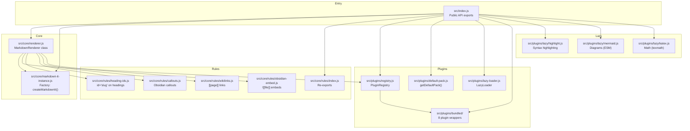

# Architecture Overview

## Module Structure

## Design Decisions

### Custom Rules vs. Plugins

Custom rules are registered directly on the markdown-it instance rather than as separate plugins. This avoids:

1. **Plugin resolution overhead** — each plugin adds a require/import and initialization call
2. **Rule ordering surprises** — plugins register rules at arbitrary positions in the ruler; inline rules let us control exact placement
3. **Bundle size** — no plugin wrapper boilerplate, no separate module boundaries

### Token Manipulation Patterns

| Rule | Token Strategy | Rationale |
|------|---------------|-----------|
| `heading-ids` | Modifies `heading_open` token attrs | Minimal change; leverages existing renderer |
| `callouts` | Replaces `inline` → `html_block`; hides `paragraph_open/close` | Single render pass; avoids double-rendering blockquote content |
| `wikilinks` | Emits `link_open` / `text` / `link_close` tokens | Preserves HTML escaping and security model of markdown-it |
| `obsidian-embed` | Emits `html_inline` token | Embed HTML is self-contained; no further processing needed |

### Why `html_block` for Callouts

Callouts are replaced with `html_block` tokens rather than `html_inline` because:

- The callout HTML is a complete block-level element (`
`)
- `html_block` tokens are rendered at the block level, avoiding wrapper `
` tags
- The surrounding `paragraph_open`/`paragraph_close` tokens are hidden to prevent nesting

### Why `link_open`/`text`/`link_close` for Wikilinks

Wikilinks emit proper link tokens (not raw HTML) because:

- markdown-it's link renderer handles `target`, `rel`, and escaping automatically
- The output is consistent with other links in the document
- Security: user-controlled content goes through the text token's escaping pipeline

## Adding a New Rule

1. Create `src/core/rules/your-rule.js`
2. Export a function `applyYourRule(md, options)` that registers rules on the `md` instance
3. Choose the appropriate ruler:
   - **Inline rules** (text-level): `md.inline.ruler.before/after("existingRule", "your-rule", handler)`
   - **Block rules** (paragraph-level): `md.block.ruler.before/after("existingRule", "your-rule", handler)`
   - **Core rules** (post-processing): `md.core.ruler.after("existingRule", "your-rule", handler)`
4. Re-export from `src/core/rules/index.js`
5. Add a toggle in `MarkdownRenderer` constructor (`src/core/renderer.js`)
6. Add test cases to `tests/core/renderer.test.md`

## Performance Considerations

- **Instance caching**: `MarkdownRenderer` constructs the markdown-it instance once in the constructor. Subsequent `render()` calls reuse the same instance, avoiding re-registration of rules.
- **No regex for callout detection**: The callout parser uses `indexOf` for `[!type]` detection, which is faster and more debuggable than regex on long strings.
- **Single-pass callout rendering**: By replacing the inline token with `html_block`, we avoid rendering the blockquote content twice (once as blockquote, once as callout).
- **Deterministic slugify**: The heading slug function is idempotent — running it twice produces the same result, enabling reliable anchor links.

## Plugin System

The plugin layer (Phase 3) sits between markdown-it and the custom rules.
For the full plugin API, LazyPlugin interface, and LazyLoader documentation,
see [docs/plugin-system.md](plugin-system.md).

## Lazy Loading

Heavy libraries (mermaid, KaTeX, highlight.js) are loaded from CDN on demand.
For the lazy loading architecture, CDN fallback, and graceful degradation,
see [docs/lazy-loading.md](lazy-loading.md).
see [docs/lazy-loading.md](lazy-loading.md), including the **Manual Verification** section for pre-release testing.
