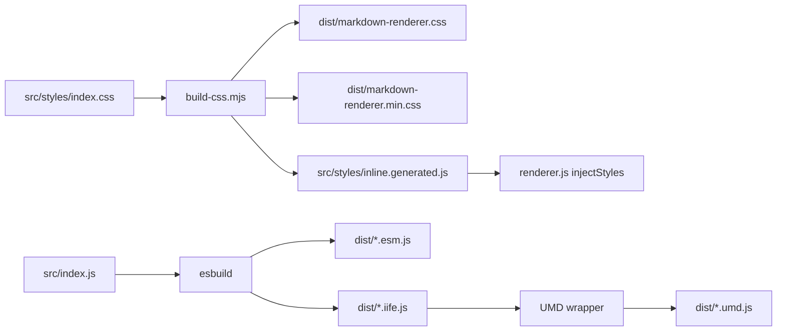

# Build Pipeline

## Overview

The build pipeline uses **esbuild** for JS bundling and **csso** for CSS minification. Both are fast, zero-config tools that keep the build simple and under 5 seconds.

```
Source (src/)  →  esbuild + csso  →  dist/
                        ↓
              inline.generated.js (baked CSS)
```

## Build Script Architecture

| Script | Purpose |
|--------|---------|
| `scripts/build-css.mjs` | Concatenates CSS modules, minifies, generates inline CSS |
| `scripts/build.mjs` | Orchestrates CSS build + 6 esbuild runs + size summary |

## Output Formats

| File | Format | Use Case |
|------|--------|----------|
| `markdown-renderer.esm.js` | ES Module | `import { MarkdownRenderer } from 'markdown-renderer'` |
| `markdown-renderer.esm.min.js` | Minified ESM | Production imports |
| `markdown-renderer.umd.js` | UMD | `require()` or AMD |
| `markdown-renderer.umd.min.js` | Minified UMD | jsDelivr default, `<script>` tag |
| `markdown-renderer.iife.js` | IIFE | `window.MarkdownRenderer` |
| `markdown-renderer.iife.min.js` | Minified IIFE | Standalone `<script>` |
| `markdown-renderer.css` | Unminified CSS | `<link rel="stylesheet">` |
| `markdown-renderer.min.css` | Minified CSS | Production CSS |

## CSS Bundling

1. `scripts/build-css.mjs` reads `src/styles/index.css`
2. Resolves `@import` statements recursively
3. Concatenates all 9 CSS modules in order
4. Writes `dist/markdown-renderer.css` (with license banner)
5. Minifies with csso → `dist/markdown-renderer.min.css`
6. Generates `src/styles/inline.generated.js` (baked CSS string)

The baked CSS is imported by `renderer.js` when `injectStyles: true`, so no separate CSS file is needed.

## CI Workflow

File: `.github/workflows/ci.yml`

- **Triggers**: Push to `main`, PRs to `main`
- **Matrix**: Node 18, Node 20
- **Steps**: Checkout → Setup Node → `npm ci` → `npm test` → `npm run build` → Upload artifact
- **Duration**: <2 minutes

## Release Workflow

File: `.github/workflows/release.yml`

- **Triggers**: Tag push (`v*`)
- **Steps**: Build + test → Create GitHub release → Attach dist/ artifacts
- **jsDelivr**: Automatically picks up new tags for CDN distribution

### Manual Release Steps

1. Bump version in `package.json`
2. Run `npm run build`
3. Commit dist/ (dist/ is tracked, not gitignored)
4. Create tag: `git tag -a v0.1.1 -m "Release v0.1.1"`
5. Push tag: `git push origin v0.1.1`
6. The `release.yml` workflow will create the GitHub release automatically
7. Wait ~60 seconds for jsDelivr to cache the new tag
8. Verify: `curl -sI https://cdn.jsdelivr.net/gh/Zoooi9918/md-render@v0.1.1/dist/md-render.umd.min.js`

## Why dist/ is committed

jsDelivr's `/gh/` path serves files directly from the **git tree** at the specified tag/branch. It does NOT serve GitHub Release attached binaries.

For CDN distribution via `cdn.jsdelivr.net/gh/Zoooi9918/md-render@v0.1.0/dist/...`, the dist/ files must exist in the git commit that the tag points to.

This is the standard pattern for libraries that want CDN distribution via `/gh/` paths before npm publish. The tradeoff is ~4.5 MB of repo size growth.

**This approach is unnecessary if the project moves to npm-only distribution**, since jsDelivr's `/npm/` path serves from registry tarballs (which include dist/ via `files:` in package.json).

## Local Development

No build step is needed for local development. The dev preview at `examples/dev-preview.html` imports directly from `src/index.js` via ES modules.

```bash
# Build (only needed for dist/ output)
npm run build

# Clean
npm run clean

# Test (no build needed)
npm test
```

## Adding a Bundled Dependency

1. `npm install <package>`
2. Add wrapper to `src/plugins/bundled/`
3. Register in `src/plugins/default-pack.js`
4. Rebuild: `npm run build`

## Performance Budgets

| Output | Max Size |
|--------|----------|
| `.esm.js` | < 200 KB unminified |
| `.esm.min.js` | < 100 KB minified |
| `.umd.min.js` | < 100 KB minified |
| `.min.css` | < 5 KB minified |
| Build time | < 5 seconds |

## Build Flow Diagram



## Deploy Site Workflow

File: .github/workflows/deploy-site.yml

- **Triggers**: Push to main with changes under site/ or dist/
- **Steps**: Checkout -> Setup Node -> npm ci -> npm test -> npm run build -> Copy site/ + dist/ to deploy/ -> Publish to gh-pages
- **Deployment**: Uses peaceiris/actions-gh-pages@v3 to publish to gh-pages branch
- **Live URL**: https://Zoooi9918.github.io/markdown-renderer/
