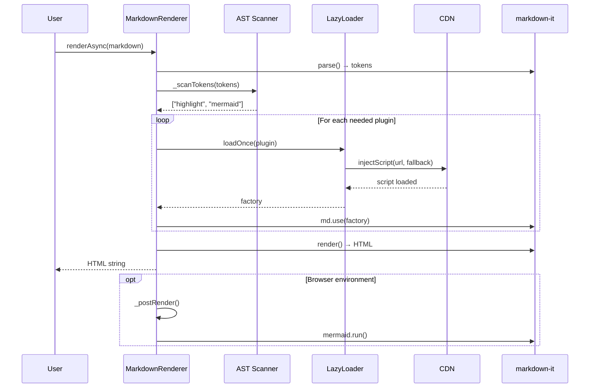

# Lazy Loading

## 1. Why Lazy Loading

The three heavy libraries used by markdown-renderer have significant bundle sizes:

| Library | Size (minified) | Impact if bundled |
|---------|----------------|-------------------|
| mermaid | ~700 KB | 700 KB added to every page load |
| KaTeX | ~250 KB | 250 KB added even for text-only docs |
| highlight.js | ~150 KB | 150 KB for docs with no code blocks |

**Total if bundled: ~1.1 MB** — unacceptable for a CDN-distributed renderer.

By lazy-loading from CDN, the base bundle stays small. Libraries are only fetched
when the rendered content actually needs them.

## 2. How LazyLoader Works

The `LazyLoader` class manages CDN resource injection with three key features:

### Script Injection
```js
await loader.injectScript(primaryUrl, fallbackUrl);
```

## Manual Verification (Before Each Release)

These tests require a real browser with DevTools. Run before every release.

### Prerequisites
1. Start local server: `npx http-server . -p 5500 -s` from project root.
2. Open `http://127.0.0.1:5500/examples/dev-preview.html`.

### Test 1: CDN Fallback Chain (jsdelivr → unpkg)
1. DevTools → Network → right-click any `cdn.jsdelivr.net` request → "Block request domain".
2. Add domain: `cdn.jsdelivr.net`.
3. Application → Storage → Clear site data.
4. Hard refresh (Ctrl+F5).
5. **Expected**: All 3 lazy plugins load from `unpkg.com` instead.
6. **Evidence**: Lazy Load History panel shows `fallback: true` for each entry.
7. Remove block → hard refresh → confirm normal behavior restored.

### Test 2: Graceful Degradation (both CDNs blocked)
1. DevTools → Network → block both: `cdn.jsdelivr.net` AND `unpkg.com`.
2. Clear site data. Hard refresh.
3. **Expected**:
  - Page does NOT blank-screen.
  - Code blocks render as plain `<pre><code>` (no colors).
  - Mermaid shows raw source in `<pre class="mermaid">`.
  - Math shows literal `$...$` as text.
  - Console shows controlled `[highlight] CDN load failed` warnings (not crashes).
4. Remove both blocks → hard refresh → confirm baseline restored.
- Creates a `<script>` tag and appends to `<head>`
- Deduplicates by URL — parallel calls to the same URL share one Promise
- On failure, automatically tries the fallback URL (e.g., jsdelivr → unpkg)

### Module Injection (ESM)
```js
const mod = await loader.injectModule(primaryUrl, fallbackUrl);
```
- Uses dynamic `import()` for ESM modules (e.g., mermaid ESM build)
- Returns the module namespace object
- Works in both browser and Node.js (for testing)

### Stylesheet Injection
```js
await loader.injectStylesheet(primaryUrl, fallbackUrl);
```
- Creates a `<link rel="stylesheet">` tag
- Deduplicates by URL

### Observability
```js
loader.getLoadHistory();  // [{ url, durationMs, success, fallback? }]
loader.getActiveLoads();  // Number of in-flight requests
loader.hasFeature("hljs"); // Check if window.hljs exists
```

## 3. AST Scan Triggers

Before rendering, `renderAsync()` parses the markdown to tokens and scans for:

| Token Type | Condition | Triggers Plugin |
|------------|-----------|----------------|
| `fence` | `token.info.trim() === "mermaid"` | `mermaid` |
| `fence` | `token.info` is non-empty, non-mermaid | `highlight` |
| `math_inline` | Any | `katex` |
| `math_block` | Any | `katex` |

Child tokens (inside lists, blockquotes) are recursively scanned.

## 4. Async Render vs Sync Render

| Method | When to use | Behavior |
|--------|-------------|----------|
| `render(md)` | Content with no lazy triggers | Synchronous, instant. Code blocks render as plain `<pre><code>`. |
| `renderAsync(md)` | Content that may need lazy plugins | Async. Scans AST, loads CDNs, then renders. |
| `renderInto(el, md)` | Browser rendering | Calls `renderAsync()` internally, then runs post-render hooks. |

**Fast path**: If the AST scan finds no lazy triggers, `renderAsync()` returns
immediately with the same output as `render()`.

## 5. CDN Fallback Strategy

Each lazy plugin defines a primary CDN URL and a fallback:

| Plugin | Primary | Fallback |
|--------|---------|----------|
| highlight.js | jsdelivr | unpkg |
| mermaid | jsdelivr | unpkg |
| KaTeX | jsdelivr | unpkg |

If the primary URL fails (network error, CORS, 404), the loader automatically
tries the fallback. If both fail, the render degrades gracefully (see below).

## 6. Graceful Degradation

When a CDN and its fallback both fail:

| Plugin | Degradation |
|--------|-------------|
| mermaid | `<pre class="mermaid">` with raw source visible |
| highlight.js | Plain `<pre><code>` with no syntax colors |
| KaTeX | `$...$` and `$$...$$` rendered as literal text |

The page **never** blank-screens or throws. Content is always visible.

## 7. How to Add a New Lazy Plugin

1. Create `src/plugins/lazy/your-plugin.js`:

```js
export default {
  id: "your-plugin",
  provides: ["capability-tag"],
  bundled: false,
  cdnScript: "https://cdn.jsdelivr.net/npm/your-lib@1/dist/your-lib.min.js",
  fallbackScript: "https://unpkg.com/your-lib@1/dist/your-lib.min.js",
  options: { /* default options */ },
  async load(loaderOpts) {
    const { injectScript } = loaderOpts;
    try {
      await injectScript(this.cdnScript, this.fallbackScript);
    } catch (err) {
      console.warn(`[your-plugin] CDN load failed: ${err.message}`);
    }
    return (md) => {
      // Register your markdown-it plugin using window.yourLib
    };
  },
};
```

2. Add to `src/plugins/lazy/index.js` barrel export.
3. Add to `getDefaultPack()` in `src/plugins/default-pack.js`.
4. Add AST scan trigger in `MarkdownRenderer._scanTokens()` if needed.

## 8. Lazy Lifecycle


