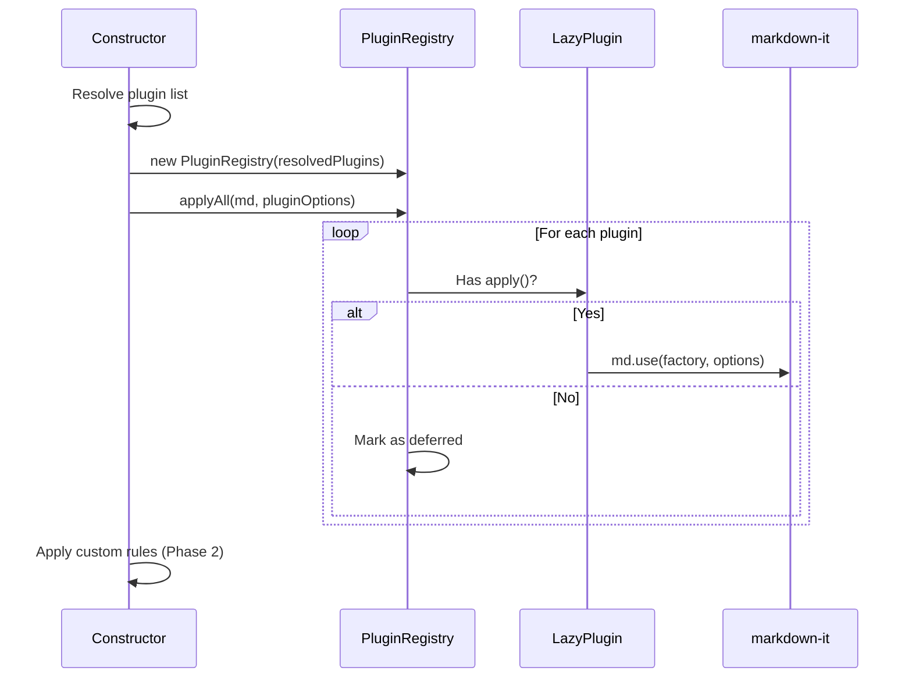

# Plugin System

## 1. Overview

A **plugin** in markdown-renderer is a self-contained extension that adds syntax
or behavior to the underlying markdown-it parser. Every plugin conforms to the
`LazyPlugin` interface, whether it ships bundled in the main file or loads
lazily from a CDN at runtime.

The plugin system is designed around three principles:
1. **Deterministic order** — plugins are applied in insertion order.
2. **Lazy-ready** — the same `LazyPlugin` shape works for both bundled and
   async-loaded plugins.
3. **Per-instance control** — each `MarkdownRenderer` instance can enable,
   disable, or override plugin options independently.

## 2. LazyPlugin Shape

```js
/**
 * @typedef {Object} LazyPlugin
 * @property {string} id           Unique plugin id (kebab-case)
 * @property {string[]} provides   Capability tags (e.g., ["mark","highlight","sub"])
 * @property {string} [version]    Optional plugin/library version
 * @property {boolean} [bundled]   true if shipped inside main bundle, false if loaded from CDN
 * @property {() => Promise<Function>} load   Returns a markdown-it plugin factory
 * @property {(md: any, options?: Object) => void} [apply]
 *           Optional shortcut for bundled plugins — runs synchronously.
 * @property {Object} [options]    Default options forwarded to the plugin
 */
```

- `id` — must be unique across the registry (kebab-case).
- `provides` — capability tags for reverse lookup (e.g., `"mark"`, `"emoji"`).
- `bundled` — `true` for Phase 3 plugins, `false` for Phase 4 CDN plugins.
- `load()` — always present; returns a `Promise<Function>` resolving to the
  markdown-it plugin factory.
- `apply(md, options)` — optional sync shortcut. When present, the registry
  calls it during `applyAll()`. When absent, the plugin is marked as deferred
  (for Phase 4 async loading).

## 3. Bundled vs. Lazy

| Category | Plugins | Size | Loading |
|----------|---------|------|---------|
| **Bundled (Phase 3)** | mark, sub, sup, ins, emoji, footnote, task-lists, deflist | <10 KB each | Sync `apply()` at constructor time |
| **Lazy (Phase 4)** | mermaid, katex, highlight.js | 150–700 KB each | Async `load()` via `LazyLoader` |

Bundled plugins are small enough to ship in the main file. Lazy plugins are
heavy and only load when their syntax is actually encountered in the markdown.

## 4. PluginRegistry API

```js
import { PluginRegistry } from "markdown-renderer";

const registry = new PluginRegistry([pluginA, pluginB]);

registry.register(pluginC);           // Add a plugin
registry.unregister("emoji");         // Remove by id
registry.getById("mark");             // Get plugin or undefined
registry.getByCapability("emoji");    // Find by capability tag
registry.has("footnote");             // Boolean check
registry.list();                      // [{ id, provides, bundled }, ...]
registry.applyAll(md, optionsById);   // Apply all sync plugins to md
registry.getDeferred();               // ["mermaid", "katex"] — skipped ids
```

- `applyAll(md, optionsById)` iterates plugins in insertion order.
- Plugins with `apply()` are called synchronously.
- Plugins without `apply()` are skipped and recorded as deferred.

## 5. LazyLoader API (Phase 4)

```js
import { LazyLoader } from "markdown-renderer";

const loader = new LazyLoader();

// Load a plugin's factory exactly once:
const factory = await loader.loadOnce(plugin);
md.use(factory);

// Inject a <script> tag from a CDN (browser only):
await loader.injectScript("https://cdn.jsdelivr.net/npm/mermaid@10/dist/mermaid.esm.min.mjs");

// Inject a <link rel="stylesheet"> tag (browser only):
await loader.injectStylesheet("https://cdn.jsdelivr.net/npm/katex@0.16/dist/katex.min.css");

// Clear the cache:
loader.reset();
```

- `loadOnce(plugin)` caches the resolved factory by `plugin.id`.
- `injectScript(url)` and `injectStylesheet(url)` are browser-only; they
  reject with a clear error in Node.js environments.

### Phase 4 Roadmap
- Mermaid plugin: lazy-loads mermaid from CDN, renders ` ```mermaid ` blocks.
- KaTeX plugin: lazy-loads KaTeX CSS + JS, renders `$...$` and `$$...$$`.
- Highlight.js plugin: lazy-loads highlight.js, auto-detects code block languages.

## 6. How to Add a Custom Plugin

1. Create a wrapper file in `src/plugins/custom/` (or any location):

```js
// my-plugin.js
import myMarkdownItPlugin from "my-markdown-it-plugin";

export default {
  id: "my-plugin",
  provides: ["my-feature"],
  bundled: true,
  options: { someOption: true },
  apply(md, options = {}) {
    md.use(myMarkdownItPlugin, options);
  },
  load() {
    return Promise.resolve(myMarkdownItPlugin);
  },
};
```

2. Register it with the renderer:

```js
import { MarkdownRenderer } from "markdown-renderer";
import myPlugin from "./my-plugin.js";

const renderer = new MarkdownRenderer({
  plugins: [myPlugin], // Replaces default pack
});
```

Or add it to the default pack by importing `getDefaultPack()` and appending.

## 7. Enable / Disable / Override via MarkdownRenderer

```js
// Disable specific plugins:
const r1 = new MarkdownRenderer({
  disablePlugins: ["emoji", "footnote"],
});

// Enable ONLY specific plugins (all others disabled):
const r2 = new MarkdownRenderer({
  enablePlugins: ["mark", "sub", "sup"],
});

// Override plugin options:
const r3 = new MarkdownRenderer({
  pluginOptions: {
    "task-lists": { enabled: false },
  },
});

// Combine:
const r4 = new MarkdownRenderer({
  enablePlugins: ["mark", "emoji", "task-lists"],
  pluginOptions: {
    "task-lists": { enabled: true },
  },
});
```

**Resolution order:**
1. If `enablePlugins` is set → filter default pack to those ids.
2. Else if `plugins` is set → use the custom array.
3. Else → use `getDefaultPack()`.
4. Always apply `disablePlugins` as a final filter.

## 8. Plugin Lifecycle



Plugins are applied to the markdown-it instance **before** the Phase 2 custom
rules (heading-ids, callouts, wikilinks, obsidian-embed), ensuring that custom
rules can override or extend plugin behavior.
