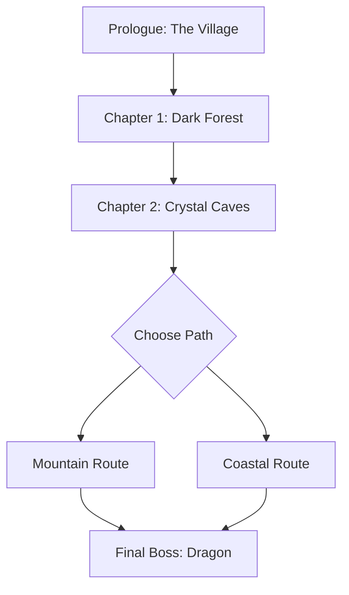

# Aetheria: Beginner's Guide

Welcome to **Aetheria**, a world of magic and mystery. This guide will help you get started on your adventure.

## Creating Your Character

Choose one of the four classes:

| Class | HP | MP | Strength | Magic |
|-------|----|----|----------|-------|
| Warrior | 120 | 20 | 18 | 4 |
| Mage | 70 | 120 | 6 | 20 |
| Rogue | 90 | 40 | 14 | 8 |
| Healer | 85 | 100 | 5 | 16 |

> [!tip] First Steps
> Start with the **Warrior** class if you're new — the extra HP gives you room to learn enemy patterns.

## Game Progression



## Essential Commands

```json
{
  "binds": {
    "move": "WASD",
    "attack": "Left Click",
    "magic": "Right Click",
    "inventory": "I",
    "map": "M",
    "quick-save": "F5"
  }
}
```

> [!warning] Save Often
> Auto-save only triggers at checkpoints. Use `F5` for manual quick-saves between battles.

## Starter Objectives

- [ ] Complete the tutorial village quest
- [ ] Defeat 3 wolves in the Dark Forest
- [ ] Find the Crystal Key in the caves
- [ ] Reach level 5
- [ ] Unlock your first magic spell

## Inventory Management

Your starting inventory includes:

: **Sword** — Basic melee weapon, 8 damage
: **Potion** — Restores 30 HP, single use
: **Map** — Shows explored areas
: **Rations** — 3 servings, restore 10 HP each

> [!danger] Boss Warning
> The **Shadow Wolf Alpha** guards the cave entrance. Do not enter below level 4, and bring at least 2 potions.

## Next Steps

When you're ready, head to [[Advanced Tactics]] for combat strategies, or check [[Item Database]] for a complete item list.

Good luck, adventurer.
