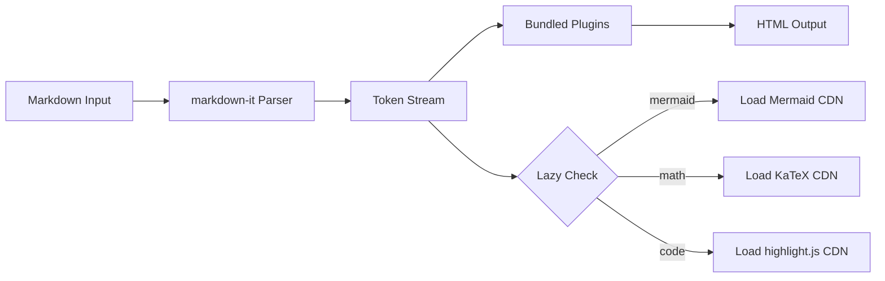

# Feature Showcase

Every feature of markdown-renderer in one document. Use this as a regression check.

## Headings

# Heading 1
## Heading 2
### Heading 3
#### Heading 4
##### Heading 5
###### Heading 6

## Text Formatting

This is **bold** and this is *italic* and this is ***bold italic***.

You can use ==highlighted text== and ++inserted text++ as well.

Subscript: H~2~O. Superscript: E = mc^2^.

## Links & Images

- [GitHub](https://github.com) — external link
- [[Wikilink Example]] — internal wikilink
- [[Wikilink Example#Heading]] — wikilink with anchor


## Lists

### Unordered

- First item
- Second item
  - Nested item
  - Another nested

### Ordered

1. Step one
2. Step two
3. Step three

### Task List

- [x] Implement core renderer
- [x] Add plugin system
- [x] Lazy load heavy deps
- [ ] Add TypeScript types
- [ ] Publish to npm

## Code

### Inline

Use `console.log()` to debug.

### Block

```javascript
function greet(name) {
  return `Hello, ${name}!`;
}

console.log(greet("World"));
```

```python
def greet(name):
    return f"Hello, {name}!"

print(greet("World"))
```

```bash
npm install markdown-renderer
npm run build
```

## Tables

| Feature | Status | Notes |
|---------|--------|-------|
| GFM | Supported | Full spec |
| Obsidian callouts | Supported | 7 types |
| Wikilinks | Supported | Configurable resolver |
| Mermaid | Lazy-loaded | ESM from CDN |
| KaTeX | Lazy-loaded | Inline + block math |

## Callouts

> [!note] Note
> This is a standard note callout.

> [!tip] Tip
> This is a helpful tip for the reader.

> [!important] Important
> This information is critical to understand.

> [!warning] Warning
> Be careful — this action has consequences.

> [!caution] Caution
> Proceed with caution in this area.

> [!example] Example
> Here's an illustrative example.

> [!quote] Quote
> "The best way to predict the future is to invent it." — Alan Kay

## Math

Inline math: the quadratic formula is $x = \frac{-b \pm \sqrt{b^2 - 4ac}}{2a}$.

Block math:

$$\int_0^\infty e^{-x^2} dx = \frac{\sqrt{\pi}}{2}$$

## Mermaid Diagram



## Footnotes

This renderer supports footnotes[^1] for additional context[^2].

## Definition List

: Markdown
A lightweight markup language for formatted text.

: Obsidian
A note-taking application that uses markdown with extended syntax.

: CDN
Content Delivery Network — used for distributing the renderer globally.

## Emoji

Here are some emoji: :smile: :rocket: :fire: :tada: :thumbsup:

## Horizontal Rule

---

## Blockquote

> This is a blockquote.
> It spans multiple lines.
>
> > And it can be nested.

---

[^1]: Footnotes allow you to add references without cluttering the main text.
[^2]: The footnote plugin is one of 8 bundled plugins.
